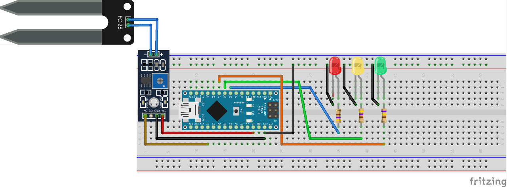

# Sistema-de-Umidade-do-solo
Código Fonte do sistema de verificação de umidade do solo 
Aula disponível: https://www.youtube.com/channel/UCf8Ge_q5js6zIm0W2p5IDXw/videos

Segue o esquema de montagem da interface física do hardware:

